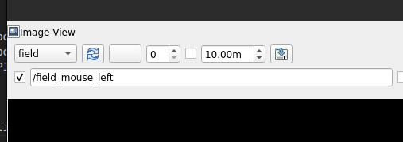

# Build

## local build

1. Make sure that ros2 is installed (tested on jazzy and humble)
2. Make sure that all packages are installed (There are might be some troubles with numpy versions)
3. Build
```bash
colcon build
```
4. Source
```bash
source install/local_setup.bash
```
5. Run
```bash
ros2 launch simple_pid_robot run.launch.py
```

## Docker
1. Build
```bash
bash build_docker.sh
```
2. Run
```bash
bash run_docker.sh
```

### Ros parameteres
#### field_node
- width : width of the field/map
- height : height of the field/map
- robot_radius : radius of drawn robot on the field. NOTE: robot is represented as 1 point, this parameter represents only visual appearnce 
- goal_radius : radius of drawn goal point on the field. NOTE: goal point  is represented as 1 point, this parameter represents only visual appearnce 
#### robot_node
- x : start x coordinate of the robot. Also is a start x for the goal point
- y : start y coordinate of the robot. Also is a start y for the goal point
- kp_x : x axis Proportional coefficient
- ki_x: x axis Integral coefficient
- kd_x: x axis Derivative coefficient
- kp_y: y axis Proportional coefficient
- ki_y: y axis Integral coefficient
- kd_y: y axis Proportional coefficient
- x_tolerance: Tolerance/acceptable error in pixel between robot pose and goal pose along x axis
- y_tolerance: Tolerance/acceptable error in pixel between robot pose and goal pose along y axis
- dt: 1 step time period. Used for robot pose publishing and PID controller time update dt

P.S.

To set a goal pose make sure that rqt_image_view left mouse click check mark is selected


# Result


