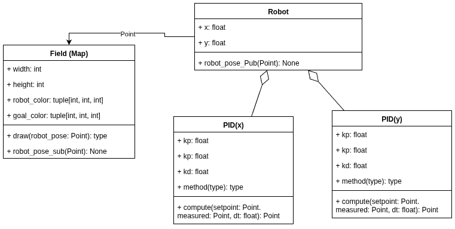

# Небольшие разьснения по поводу подхода

## Класс Field
Класс Field создан только для отрисовки текущего положения робота и целевой точки на поле. Его параметры задаются только для задания размера поля цвета и размера робота/целевой точки. Данный класс получает только информацию о положении робота по топику "/robot_pose" и информацию о положении целевой точки (если она изменилась через топик "/field_mouse_left")

## Класс Robot
В данном классе реализуется логика вычисления положения робота в 2D пространстве. Положение  вычисляется по простой кинематике. А упарвление происходит за счет ускорений полученных из PID регулятора. Класс аггрегирует 2 PID контроллера для независимого управления ускорениями по 2 осям. Была выбрана аггрегация, так как создавать отдельную ros2 Node нет смысла, так как она бы создавала дополнительную нагрузку на сеть (Конечно есть compasable ноды, но они немного усложнили логику и архитектуру программы). Также решение было в пользу 2 более простых независимых PID контроллеров, так как кинематика довольно простая и не требует дополнительных усоловий, которые накладывали бы ограничения на ускорения по осям, также разделение на 2 контроллера увеличивает читабоельность кода и соответсвует DRY подходу проектирования.